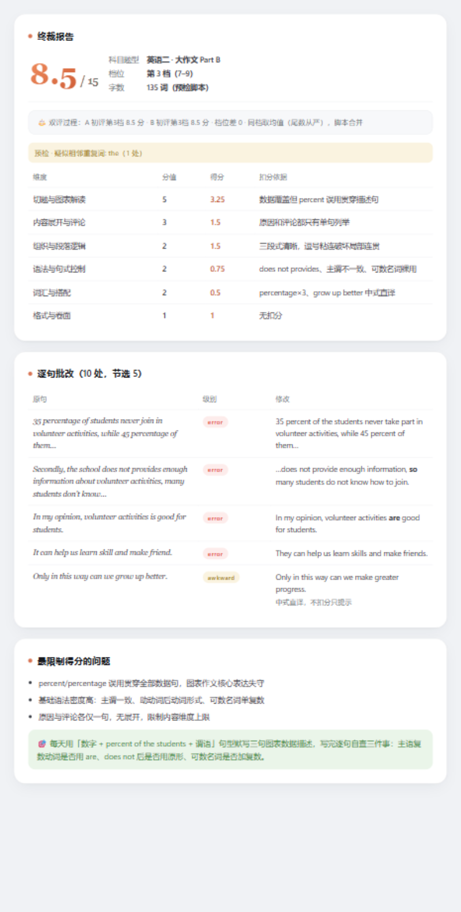

# DuoGrader · 双评阅卷官

> 像真实考研阅卷一样批改英语作文：**两位 AI 阅卷员独立打分 + 分差仲裁 + 逐句精改**。
> 自带 API key，免会员，数据不出本地。



## 为什么做这个

商业批改（扇贝会员、按篇付费）把最成熟的 LLM 能力包了会员墙。DuoGrader 的判断是：**批改质量的瓶颈不在模型，在评分流程**——单次 LLM 打分有半档到一档的随机波动，把打分噪声焊死才是产品核心。所以我们复刻了真实考研阅卷的制度设计：

```
题面 + 作文 + 预检事实
        │
   ┌────┴────┐
   ▼         ▼          两次独立请求，互相看不到对方
 Grader A   Grader B    （同一 key 同一模型即可，无需两个账号）
   └────┬────┘
        ▼
     仲裁者               同档 → 维度分取均值（.5 从严）
   （第三次请求）          差一档 → 引用档位描述二选一裁决
                          差两档 → 判定失效，重新双评
```

配合**确定性预检**（字数、段落数、格式由脚本算好，模型只引用不自算）和**机器可校验的 JSON 输出**（维度分之和必须落在所裁档位区间，不达标自动打回重评）。

## 三道防线，治 LLM 批改的三个老毛病

| LLM 批改老毛病 | DuoGrader 的对策 |
|---|---|
| 分数会飘，评两次差一档 | 双评独立请求 + 仲裁阶梯 + 分差长期记录 |
| 把对的改错、过度润色 | 三级错误分级（error/awkward/style），拿不准一律降级，只有 error 计入扣分 |
| 字数数不对、格式看不见 | 预检脚本先行，事实清单注入，模型禁止自算 |

## 快速开始（Agent skill 用法）

```bash
git clone https://github.com/5777-wq/duograder.git
```

把仓库交给支持 skill 的 agent（Codex / Claude Code / ZCode 等），对它说：

> 读取 skill/kaoyan-essay/SKILL.md 并按其执行：批改这篇考研英语作文（英二大作文，题面如下……）

纯脚本预检（不依赖 agent，字数/段落/格式确定性检查）：

```bash
python skill/kaoyan-essay/scripts/precheck.py --track english-ii --task large essay.txt
```

验证记录与双评原始数据见 [docs/validation/](./docs/validation/)。

## 仓库内容

```
skill/kaoyan-essay/
├── rubrics/writing-rubric.md      # 评分规则（官方五档转写+维度分+扣分锚点+双评协议）
├── schema/grading-report.schema.json   # 结构化输出契约（机器校验）
└── scripts/                        # 预检脚本（M1）
```

本仓库**不包含任何真题原文与教辅范文**（版权原因），仅提供导入器，真题由用户自行导入本地使用。

## 验收标准（预注册）

结果将如实公布，失败照报：

| # | 实验 | 标准 | 结果 |
|---|---|---|---|
| 1 | 同一篇作文开双评跑 3 遍 | 最终档位波动 0 档（有波动则公布分差分布） | ✅ 合成作文：第三档 8.5/8.5/8.5，档位与总分零波动（2026-10-08，6 位独立评员；真题作文口径待补） |
| 2 | 逐句批改人工抽查 ≥20 处 | 把对的改错 = 0 处 | ✅ **35 处全量核对，把对的改错 = 0**（2026-10-09，[审计报告](./docs/validation/audit-20261009.md)；局限：审计者与评分器同源，欢迎第三方抽验） |
| 3 | 字数统计 vs 人工统计 | 误差 ≤ 2 词 | ✅ precheck.py 为确定性实现，与 JS 版交叉测试误差 0 词（[test.mjs](./app/test.mjs) 口径对齐回归） |
| 4 | 分档区分度（追加，非预注册） | 好/中/差作文分数递减 | ✅ 合成三篇 14 / 8.5 / 7；第二/三档边界经仲裁裁决（rationale 见 [docs/validation](./docs/validation/2026-10-08/dryrun-summary.md)） |
| 5 | 句级批改种子查全率（追加，非预注册） | 预植错误检出率 | ✅ 内核 v1.0 92% → **v1.3 100%**（12 颗种子 × 双盲评员，0 误报；[实验记录](./docs/validation/kernel-eval-20261009/SUMMARY.md)） |
| 6 | 已知局限 | — | ⚠️ 全部验证基于合成作文与英二大作文档；英一 20 分档/小作文/人工锚点校准待补（见下"已知局限"） |

## 已知局限

- **"准"还没有锚点**：实验 1 证明的是稳（精密度），8.5 分是否是"对的 8.5"尚无人工专家分对照。合成作文与评分器同源，绝对档位存在内核版本间漂移（v1.0→v1.3 同篇漂移一档，均在可辩护范围）。校准（锚点样文 / pairwise 排序）是路线图最高优先级。
- **覆盖面偏科**：英一 20 分档与小作文 10 分档已完成首轮验证（分值表/维度表/档位区间/格式检测均正确执行，见 [coverage-20261009](./docs/validation/coverage-20261009/SUMMARY.md)），但每档样本量为 1；多档位分布与真人对照仍待校准机制。
- **字迹泛化**：拍照转写链路未在真实手写字迹上系统评估。

## 路线图

- [x] v0.1 评分规则 + 输出契约
- [x] v0.2 Agent skill 完整版（SKILL.md + precheck.py + validate_report.py，端到端空跑通过 2026-10-08）
- [ ] v0.3 校准机制（锚点样文导入 + pairwise 排序 + 仲裁报告 schema）
- [ ] v0.4 考生档案（错题本 + TOP-5 高频错误注入）
- [ ] v0.5 真题导入 + 模板蒸馏（范文骨架槽位化，生成个人句式资产）

## 致谢

评分规则的组织思路参考了 [echo-kaoyan-english-skill](https://github.com/nghjjnjnf/echo-kaoyan-english-skill)，官方档位描述转写自考试大纲评分标准。

## License

MIT
